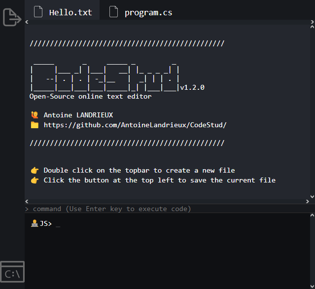

# CodeStud

Simple HTML/CSS/JS text editor

> 
> <https://antoinelandrieux.github.io/CodeStud>

---

## Documentation

no document available

## Contributing

The CodeStud source code is located in the Git repository at [github.com/AntoineLandrieux/CodeStud](https://github.com/AntoineLandrieux/CodeStud/).
Contributions are most welcome by forking the repository and sending a pull request.

## Credit

- [Antoine Landrieux](https://github.com/AntoineLandrieux) - Developer
